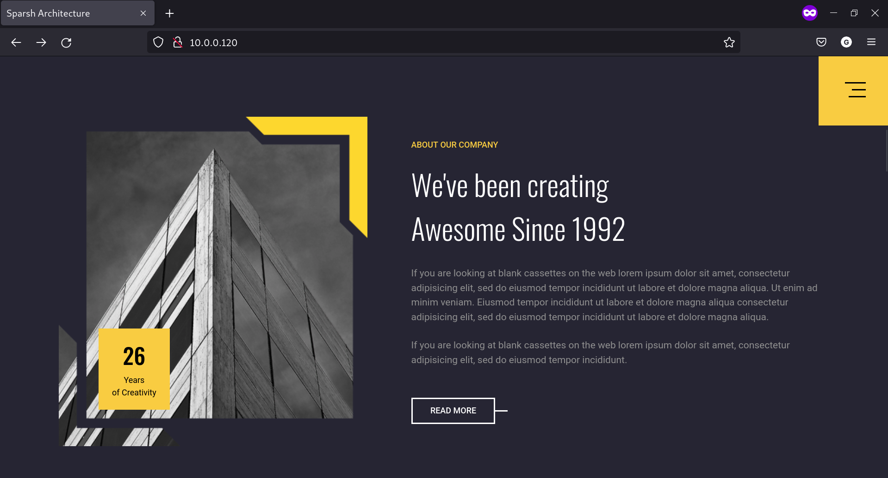

# Linux - Desafio 01: Infraestrutura como código
Repositório com o código do desafio da aula "Infraestrutura como Código: Script de provisionamento de um servidor web (apache)". Bootcamp Jornada DevOps com AWS - Impulso, DIO.

## O que foi desenvolvido nesse projeto?
Um simples script que faz o provisionamento de um servidor web Apache, para que seja possível disponibilizar o website mostrado na imagem abaixo.

> Link do bootcamp [AQUI](https://web.dio.me/track/jornada-devops-com-aws-impulso)!

